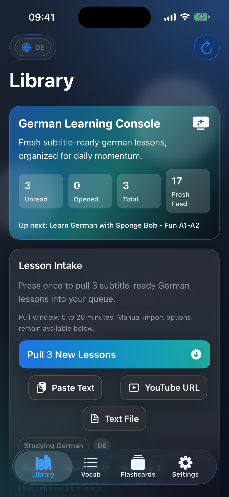
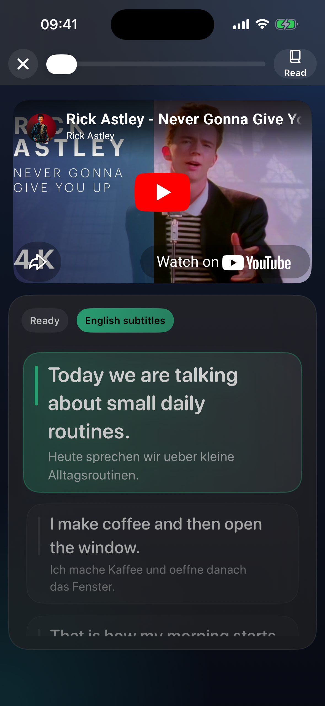
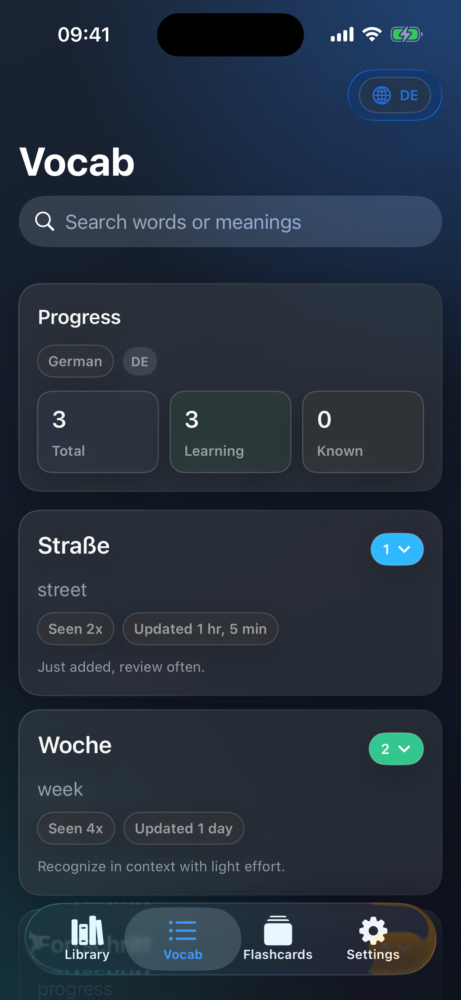
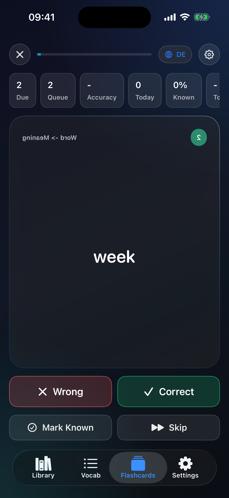

# LanguageReader

LanguageReader is an iOS reading-first language learning app for German and Kannada. It keeps reading, lookup, vocabulary tracking, flashcards, and subtitle-based lesson import in one offline-friendly workflow, with English as the supporting meaning/translation language.

Fresh installs now default to German. Existing installs are preserved as Kannada so older libraries and vocab do not shift under users after migration.

## Supported Languages

| Source language | Status | Notes |
| --- | --- | --- |
| German (`de`) | First-class | Default study language for fresh installs, language-scoped library/vocab/flashcards/discovery, bundled offline dictionary, English-target translation flow |
| Kannada (`kn`) | First-class | Preserved for migrated installs, original dictionary pipeline, full reader/vocab/flashcards/YouTube flow |

The UI remains in English. Language support here refers to the content language being studied.

## Screenshots

| Library | Watch |
| --- | --- |
|  |  |

| Vocab | Flashcards |
| --- | --- |
|  |  |

## Product Snapshot

- Library-first home with study-language selection, text import, file import, YouTube URL import, and one-tap lesson pulls.
- Reader that uses each document's stored language, so mixed German/Kannada libraries remain safe after language switching.
- Offline dictionary lookup with language-aware heuristics, override files, missing-word logging, and optional cloud fallback cache.
- Shared learning state across Reader, Vocab, and Flashcards, scoped by the selected study language.
- Due-based flashcards with simple right/wrong review and daily telemetry.
- Subtitle-gated YouTube discovery/import/watch flow parameterized by the active study language.
- English-target sentence and subtitle translation with language-aware rejection of unchanged or obviously source-language output, plus best-effort fallback when Azure is unavailable.

## Learning Flow

1. Pick a study language from the toolbar or Settings.
2. Import text, a text file, a YouTube URL, or pull a batch of subtitle-ready lessons.
3. Read in full-text mode or sentence mode and tap words for meanings.
4. Save words into vocab and review them later in flashcards.
5. Switch languages at any time; documents keep their own language and vocab queues stay scoped correctly.

## Language-Scoped Behavior

- `Document` and `VocabEntry` both persist `languageCode`.
- Vocab identity is language-scoped, so the same normalized word can exist in German and Kannada without collision.
- Ignored words, flashcard telemetry, auto-import history, suggestion cache state, and dictionary override/missing files are all language-scoped.
- Library shelves, Vocab, Flashcards, Settings quality checks, and YouTube discovery/import follow the currently selected study language.
- Reader lookup and subtitle translation follow the stored document language, not the global picker.

## Dictionary Pipeline

- Kannada uses the existing Alar-based SQLite build path.
- German uses a bundled SQLite dictionary built from the official FreeDict German-English TEI source.
- Runtime lookup selects the provider by language code and falls back to per-language sample data only if a bundled/document dictionary is missing.
- Local correction files live in app Documents and are split by language:
  - `dictionary_overrides.tsv` / `dictionary_missing.tsv` for Kannada
  - `dictionary_overrides_de.tsv` / `dictionary_missing_de.tsv` for German
  - `dictionary_cloud_cache.tsv` remains shared but keyed by language + normalized key

Build bundled dictionaries:

```bash
./scripts/build_dictionary.py
```

Install both bundled dictionaries into the simulator Documents container:

```bash
./scripts/install_dictionary.sh
```

Evaluate dictionary quality:

```bash
python3 scripts/evaluate_dictionary.py --source-language de --report-json /tmp/german_dictionary_eval.json
python3 scripts/evaluate_dictionary.py --source-language kn --report-json /tmp/kannada_dictionary_eval.json
```

## YouTube Import

- Discovery, validation, and import are scoped to the selected study language.
- German requires real `de*` subtitle tracks.
- Kannada keeps the existing direct-`kn` preference with translated fallback when direct tracks are missing.
- Imported YouTube lessons persist flattened text, timed subtitle cues, and language metadata for later Reader/Watch use.
- Older imported video lessons that cannot recover timed cues from YouTube synthesize a coarse subtitle timeline from the stored lesson body so `Watch` still has usable subtitle lines.
- Watch mode starts English subtitle translation in the background as soon as you open a video lesson, then reuses cached English cues when available.

## Quick Start

Prerequisites:

- Xcode
- iOS Simulator
- `xcodegen` (`brew install xcodegen`) if project files need regeneration

Run locally:

```bash
./scripts/boot_simulator.sh
./scripts/build.sh
./scripts/run.sh
```

Run tests:

```bash
./scripts/test.sh
```

## Testing

- Unit coverage now includes language migration, study-language defaults, language-scoped caches/stats, German subtitle gating, German import/discovery, and dictionary language-profile behavior.
- Simulator verification remains mandatory for touched flows.
- German dictionary evaluation fixture is available under `scripts/eval_fixtures/german_core_v1.json`.

## Documentation Map

- Active roadmap: `PLAN.md`
- Development workflow and verification commands: `DEVELOPMENT.md`
- Durable architecture decisions: `DECISIONS.md`
- New-language wiring checklist: `docs/LANGUAGE_ONBOARDING_CHECKLIST.md`

## Known Limits

- German morphology support is intentionally conservative in this pass. It handles common inflection endings, not full lemmatization or compound splitting.
- English UI only; this is source-language support, not interface localization.
- YouTube import still depends on public subtitle availability and transcript quality.
- Flashcard scheduling remains fixed-bucket rather than fully adaptive.
- No cloud sync in V1.
