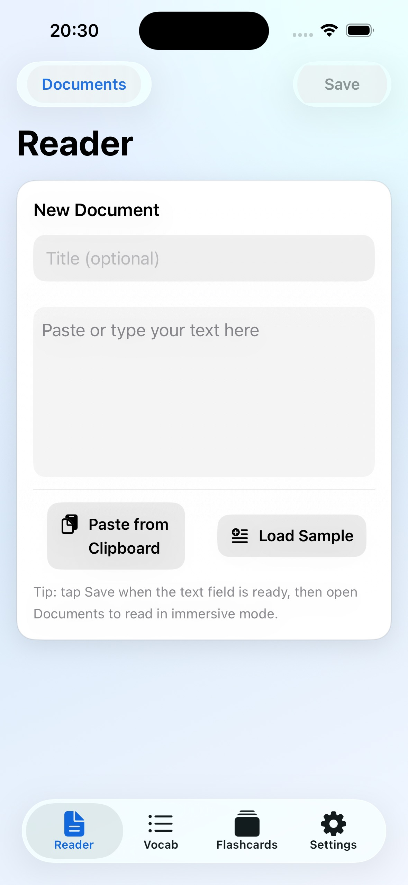
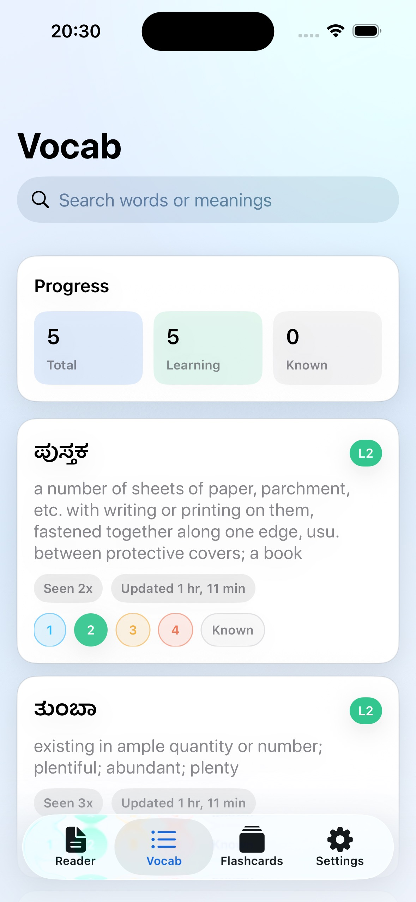
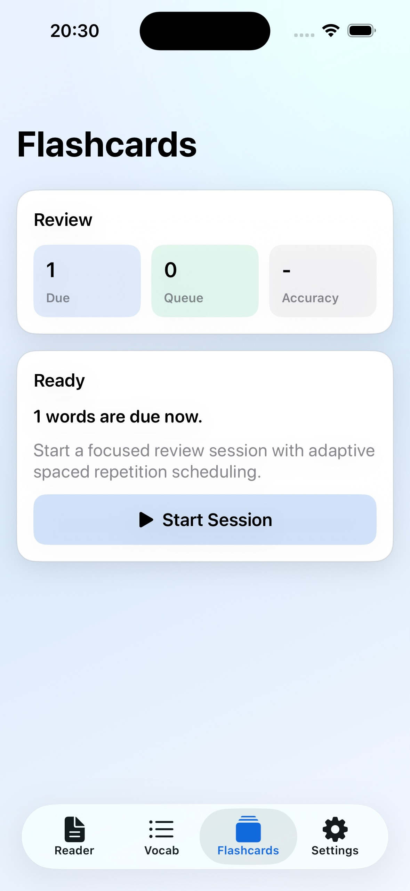
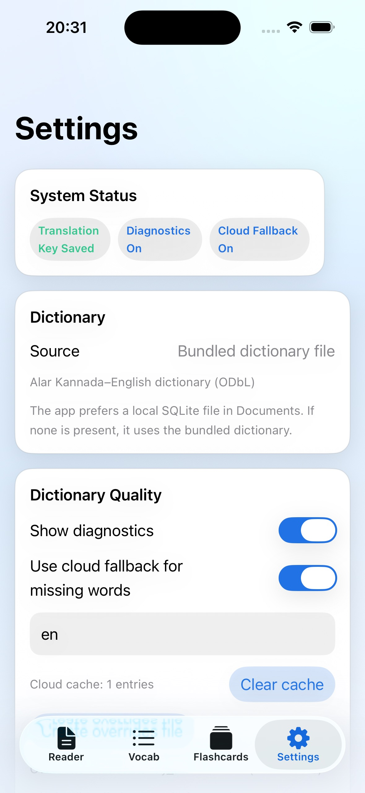

# LanguageReader

An iOS reading-first language learning app (initial scope: Kannada) with offline word lookup, vocabulary tracking, and due-based spaced-repetition flashcards.

## Product Snapshot
- Start from a Library-first home with import actions, beginner suggestions, and continue-reading shelves.
- Import from in-app text paste, text file, or YouTube URL (Kannada subtitles required for YouTube import).
- Pull a one-tap `Pull 3 New Lessons` run to top up subtitle-validated Kannada lessons.
- Keep content fresh automatically with app-use top-up triggers and cooldown limits.
- Read saved lessons in a distraction-light interface designed for long sessions.
- Tap words to get instant meanings, pronunciation, and vocabulary actions.
- Keep learning state unified across Reader, Vocab, and Flashcards.
- Review only what is due with a simple right/wrong card flow.
- Work fully offline by default; optional cloud translation/fallback is additive.
- Tune flashcard session load from Settings with a subtle `Words per session` control (default: 5).
- Flashcards show both `Due` total and current `Session` word count so session sizing is explicit.
- Flashcards include lightweight learning telemetry (`Today`, `Known`, `Today Acc`) for quick daily loop checks.

## Screenshots

| Reader | Vocab |
|---|---|
|  |  |

| Flashcards | Settings |
|---|---|
|  |  |

## Core UX
- **Library-first flow**: open to a queue-first home (`Lesson Intake`, `Unread Lesson Queue`, `Discovery Feed`, `My Library`).
- **One-tap importing**: `Paste Text`, `Text File`, and `YouTube URL` imports are available directly on the home screen.
- **Subtitle-gated YouTube import**: only videos with Kannada subtitle tracks are imported.
- **Suggestion personalization**: suggestion ordering prioritizes followed channels and previously successful categories/channels from your library.
- **Liquid-glass interface layer**: thin/ultra-thin material cards, pills, and controls add depth while preserving contrast.
- **Word-level intelligence**: dictionary lookup path tracking (`direct`, `suffix`, `redirect`, `override`, `cache`, `remote`, `none`).
- **Progressive vocab states**: `1`, `2`, `3`, `4`, `Known` with one shared definition source.
- **Status picker on badges**: tap a word’s level badge to open `1/2/3/4/Known` options with meanings and a selected checkmark.
- **Session-focused flashcards**: due filtering, card flip recall, binary right/wrong feedback, and directional reinforcement.
- **Sentence support**: one-sentence paging with transliteration and translation fallback.

## Spaced Repetition (Words Only)
- Each due word is tested in both directions in the same session (`word -> meaning`, `meaning -> word`) using separated passes to avoid immediate back-to-back reversals.
- Card feedback is binary (`Correct` / `Wrong`) with no `Again/Hard/Good/Easy` ratings.
- Levels auto-progress only from `1` to `4` (promotion requires two fully-correct rounds in a row).
- `Known` is manual only; the app never auto-promotes to `Known`.
- Fixed due buckets by level: `1 day`, `3 days`, `7 days`, `15 days`.
- Standardized status meanings:
  - `1`: Just added, review often.
  - `2`: Recognize in context with light effort.
  - `3`: Mostly familiar, occasional review.
  - `4`: Confident recall, rare review.
  - `Known`: Fully known, hidden from practice lists.

## Getting Started
Prerequisites:
- Xcode (latest stable)
- iOS Simulator (prefer iPhone 14 Pro)

### Xcode
1. Open `LanguageReader.xcodeproj`.
2. Select an iPhone simulator.
3. Build and Run.

### CLI
- Boot simulator: `./scripts/boot_simulator.sh`
- Build: `./scripts/build.sh`
- Run (build + install + launch): `./scripts/run.sh`
- Test: `./scripts/test.sh`
- List simulators: `xcrun simctl list`

## YouTube Import Notes
- Paste a full YouTube URL in `Library -> Lesson Intake -> YouTube URL`.
- Import accepts videos when subtitle extraction succeeds and transcript quality is readable for study.
- Import prefers native Kannada subtitle tracks (`kn*`) and can fall back to translatable tracks rendered in Kannada when direct `kn` tracks are missing.
- Import also enforces subtitle readability checks so number-only / low-text transcripts are rejected.
- Beginner suggestions now come from dynamic channel RSS discovery plus live YouTube search-results discovery (not static video IDs).
- Suggestion cards support channel follow/unfollow, and ranking adapts to followed channels plus your prior import history.
- `Pull 3 New Lessons` targets 3 lessons per tap.
- Candidate duration window is 5 to 20 minutes.
- Repeat-import fallback is disabled by default so pulls prioritize fresh videos; optional fallback can still be enabled in Settings.
- Auto top-up runs on app launch and Library entry when enabled, cooldown has elapsed (24h default), and unread imported lessons are below threshold (`< 3`).
- Discovery and validation results are cached locally with TTL and backoff to reduce repeated network cost; force refresh revalidates previously cached invalid candidates to recover from transient failures.
- Pull/import history is persisted locally so already-imported video IDs are avoided even if library rows are later deleted.
- Discovery cards are split into `New to Import` and `Already in Library` so feed state is explicit.
- Background refresh is optional and best-effort; foreground checks still enforce deterministic top-up rules.
- Imported YouTube lessons persist on-device like any other library item.

## Dictionary Pipeline
- Bundled SQLite dictionary powers offline lookup.
- SQLite lookups are serialized with per-lookup prepared statements to avoid concurrent read races during sentence-mode background meaning prefetch.
- Build/update bundled dictionary:

```bash
./scripts/build_dictionary.py
```

- Evaluate dictionary quality against fixtures:

```bash
python3 scripts/evaluate_dictionary.py --report-json /tmp/dictionary_eval_report.json
```

- Summarize `dictionary_missing.tsv` by frequency:

```bash
python3 scripts/summarize_missing_words.py --input Documents/dictionary_missing.tsv --top 20
```

- Runtime prefers app-container dictionary if present, otherwise bundled fallback.
- Local correction files in app Documents:
  - `dictionary_overrides.tsv`
  - `dictionary_missing.tsv`
  - `dictionary_cloud_cache.tsv`
- Settings now includes `Dictionary Quality` evaluation with:
  - token coverage
  - unique coverage
  - gold hit rate
  - gold accuracy
  - quality gate pass/fail and top unresolved words
- Dictionary settings intentionally keep this area quality-focused to reduce noise in the reading workflow.
- Settings quality uses your saved documents for coverage and your saved vocab meanings for accuracy.
- If you have no local documents/vocab yet, quality falls back to a built-in language fixture baseline.
- Missing-word regression fixtures are tracked in `LanguageReaderTests/Fixtures/dictionary_missing_fixture.tsv`.
- Fixture-driven verification runs in `LanguageReaderTests/DictionaryMissingFixtureTests.swift`.

## Optional Translation Setup
Translation is optional and not required for core functionality.

In **Settings -> Translation API**, provide:
- Endpoint (example): `https://api.cognitive.microsofttranslator.com`
- Region (optional for global translator resources)
- API key (stored in Keychain)

## Quality Bar
- Deterministic domain logic where practical.
- Strong unit coverage on tokenizer, dictionary lookup paths, vocab state resolution, and flashcard scheduling.
- Full simulator test runs supported via `./scripts/test.sh`.
- Every shipped change must also be verified in the running simulator app (`./scripts/run.sh`) for the affected user flow; unit tests alone are not sufficient.
- Reliability-first policy: if iPhone 14 Pro handles it smoothly, prefer stronger correctness and resilience over reducing storage/network/cost.
- Every user-visible regression must add an automated reproduction test for the specific failure mode before the fix is considered complete.

## Documentation Map
- Product plan and checkpoints: `PLANS.md`
- Development workflow: `DEVELOPMENT.md`
- UX and behavior details: `DESIGN.md`
- Architecture decisions: `DECISIONS.md`
- Language onboarding checklist: `docs/LANGUAGE_ONBOARDING_CHECKLIST.md`

## Known Limits (Current Scope)
- Kannada is the first fully wired language profile.
- Morphology handling is heuristic, not full linguistic analysis.
- Per-word cloud fallback is context-light and can vary by sentence context.
- Flashcard intervals still use fixed level buckets; adaptive calibration against long-run retention is pending more usage data.
- Auto content discovery depends on public YouTube feed/web endpoint availability; on failures the app falls back to cached suggestions.
- No cloud sync in V1.
